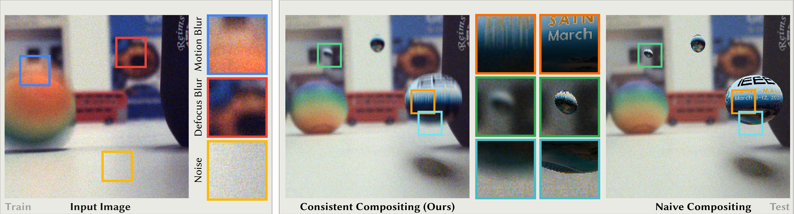

# Blind Augmentation: Calibration-free Camera Distortion Model Estimation for Real-time Mixed-reality Consistency

[]()
[](https://prakashsidd18.github.io/projects/blind_augmentation/)
[](https://youtu.be/YhK5wjmVYjg)
[](https://youtu.be/wQ7zTkip2yU)
[](https://1drv.ms/p/c/a220080a7f502ec5/EWekm8VApqtLiqN8srFWvwIBbqiRucFjvkj0OnzKHBLR0g?e=RbMZlZ)

[Siddhant Prakash](https://prakashsidd18.github.io/)<sup>1</sup>, [David R. Walton](https://drwalton.github.io/)<sup>2</sup>, [Rafael K. dos Anjos](https://rafaelkuffner.github.io/)<sup>3</sup>, [Anthony Steed](https://wp.cs.ucl.ac.uk/anthonysteed/)<sup>1</sup>, [Tobias Ritschel](https://www.homepages.ucl.ac.uk/~ucactri/)<sup>1</sup>


<sup>1</sup>University College London, <sup>2</sup>Birmingham City University, <sup>3</sup>University of Leeds<br>



<div style="text-align: justify"> 
Our method “blindly” estimates a model of noise, motion blur (MB) and depth of field (DoF) from input frames (left), i.e., without
		requiring any known calibration markers / objects. The model can then augment other images with virtual objects that appear visually
		consistent (middle).
    </div>

### Table of Contents
- [Abstract](#abstract) 
- [Dataset, Code & Preprocess](#code)
    - [Dataset Download](#1-dataset-download) 
    - [Install](#2-setup)
    - [Run](#3-running-on-standard-dataset)
    - [Pre-process](#4-preprocess)
- [Real-time Unity Demo](#demo)
- [Citation](#citation)

<a name="abstract"></a>
## Abstract 

<div style="text-align: justify">
Real camera footage is subject to noise, motion blur (MB) and depth of field (DoF). 
In some applications these might be considered distortions to be removed, but in others it is important to model them because it would be ineffective, or interfere with an aesthetic choice, to simply remove them. 
In augmented reality applications where virtual content is composed into a live video feed, we can model noise, MB and DoF to make the virtual content visually consistent with the video. 
Existing methods for this typically suffer two main limitations. 
First, they require a camera calibration step to relate a known calibration target to the specific cameras response. 
Second, existing work require methods that can be (differentiably) tuned to the calibration, such as slow and specialized neural networks. 
We propose a method which estimates parameters for noise, MB and DoF instantly, which allows using off-the-shelf real-time simulation methods from e.g., a game engine in compositing augmented content. 
Our main idea is to unlock both features by showing how to use modern computer vision methods that can remove noise, MB and DoF from the video stream, essentially providing
self-calibration. 
This allows to auto-tune any black-box real-time noise+MB+DoF method to deliver fast and high-fidelity augmentation consistency.
</div>


<a name="code"></a>
## Dataset, Code & Preprocess

We provide code to run optimization and compositing along with a dataset with 7 scenes used in the original paper. 

We have run pre-process on the 7 scenes and provide all intermediary frames along with compositing frames. 

For new dataset/scenes we point to original implementation of off-the-shelf methods which we used for pre-processing in this paper. 

<a name="1-dataset-download"></a>
### 1. Dataset Download

All 7 scenes can be dowloaded from [here](https://1drv.ms/u/c/a220080a7f502ec5/EcKLUxvCr0FErE8oHVezmxkBULjS83dSpiBC_6LZXcWm4w?e=mNYh27) (~7GB).

We also provide a smaller dataset (with 2 scenes) to quickly run our single-frame optimization (see [Run](#3-running-on-standard-dataset)) [here](https://1drv.ms/u/c/a220080a7f502ec5/ETL2DPPovrRKnf6fZLbwsQsBWrfgcFr4f9aCzij1cXiBRA?e=dU5Eic) (~380MB). 


Once downloaded, unzip the zipped file to store data in the following folder structure:

```sh
.
.
├── blur_utils.py
├── composite_module.py
├── data
│   ├── composites
│   │   ├── flir_noisy_greenballmotion
│   │   ├── flir_noisy_rainbowballmotion
│   ├── de_focus_blurred
│   │   ├── flir_noisy_greenballmotion
│   │   ├── flir_noisy_rainbowballmotion
│   ├── de_motion_blurred
│   │   ├── flir_noisy_greenballmotion
│   │   ├── flir_noisy_rainbowballmotion
│   ├── denoised
│   │   ├── flir_noisy_greenballmotion
│   │   ├── flir_noisy_rainbowballmotion
│   ├── depth
│   │   ├── flir_noisy_greenballmotion
│   │   ├── flir_noisy_rainbowballmotion
│   ├── flow
│   │   ├── flir_noisy_greenballmotion
│   │   ├── flir_noisy_rainbowballmotion
│   └── original
│       ├── flir_noisy_greenballmotion
│       ├── flir_noisy_rainbowballmotion
.
.
├── main_optimization_timing.py
├── main_real_time_update_params.py
├── main_single_frame_optimization_composite.py
.
.
```
The `<path/to/dataset/>` is the path to `data` folder. The original captured image are stored in `./data/original/<SCENE>/` folder. 

Pre-process can be run on new dataset by providing captured frames in this folder. See [Pre-process](#4-preprocess) for more details.

Composite frames are dataset/scene specific and are rendered using Blender.
A sample Blender file with automated scripts to generate composite frame (geometry + differential rendering) buffers for each frame in the scene is provided `flir_noisy_rainbowballmotion.blend`.


<a name="2-setup"></a>
### 2. Install

1. Clone this repo, then `cd` into it.  
2. Create a virtual environment (recommended).

    ```sh
    # Ensure Python version >= 3.10.14
    python -s -m venv .venv_blind_augmentation
    source .venv_blind_augmentation/bin/activate
    ```

2. Install local requirements:

    ```sh
    python -s -m pip install -r requirements.txt
    ```

All requirements to run code will be installed in the virtual environment.

<a name="3-running-on-standard-dataset"></a>
### 3. Run

1. Download the standard dataset (see above) and copy `<path/to/dataset/>`.
2. Run single frame optimization & compositing using the script `main_single_frame_optimization_composite.py` specifying `<path/to/dataset/>` as argument. If no path is specified, the script assumes `<path/to/dataset/>` as current folder `./data/`.

    ```sh
    # Run optimization on single-frame and composite
    python main_single_frame_optimization_composite.py <path/to/dataset/>
    ```
3. We also provide script to run multi-frame optimization `main_real_time_update_params.py` and time the optimization code `main_optimization_timing.py`.

    ```sh
    # Run optimization on multi-frames and composite
    python main_real_time_update_params.py <path/to/dataset/>

    # Time the optimization 
    python main_optimization_timing.py <path/to/dataset/>
    ```
The script will generate results in `./output/` folder in the current directory. 

Each script can generate results from multiple scenes, which can be toggled ON/OFF as desired. 
A separate folder inside the output folder for each scene will be created.
The ouput videos can be found in respective scene folder as `./output/<SCENE>_result_/*.mp4`. 

For example, results for scene `flir_noisy_rainbowballmotion` will be stored as `./output/flir_noisy_rainbowballmotion_result_/flir_noisy_rainbowballmotion_result_blurred_composite.mp4` and a comparison with naive approach as `./output/flir_noisy_rainbowballmotion_result_/flir_noisy_rainbowballmotion_result_naive_vs_ours.mp4`.

<a name="4-preprocess"></a>
### 4. Pre-process

All off-the-shelf operator used in this paper are summarized along with their code repositories in the table below. 
These codes were used out-of-the-box with pre-trained models provided in their respective repositories.  

|    Operation    |                                        Method                                        |                                           Code                                           |
|:---------------:|:------------------------------------------------------------------------------------:|:----------------------------------------------------------------------------------------:|
|   `removeMB`    |     [Li et al. 2023](https://dasongli1.github.io/publication/grouped-shift-net/)     |     [https://github.com/dasongli1/Shift-Net](https://github.com/dasongli1/Shift-Net)     |
|   `removeDoF`   |          [Ruan et al. 2022](https://lyruan.com/Projects/DRBNet/index.html)           |      [https://github.com/lingyanruan/DRBNet](https://github.com/lingyanruan/DRBNet)      |
|  `removeNoise`  |               [Zamir et al. 2022](https://arxiv.org/abs/2111.09881)                |         [https://github.com/swz30/Restormer](https://github.com/swz30/Restormer)         |
|    `getFlow`    | [Ilg et al. 2017](https://lmb.informatik.uni-freiburg.de/Publications/2017/IMKDB17/) | [https://github.com/NVIDIA/flownet2-pytorch](https://github.com/NVIDIA/flownet2-pytorch) |
|   `getDepth`    |               [Ranftl et al. 2019](https://arxiv.org/abs/1907.01341v3)               |           [https://github.com/isl-org/MiDaS](https://github.com/isl-org/MiDaS)           |


We provide a bash script `preprocess.sh` which can be used to create all intermediary data (except composite frames) from 
original frames. 
This script lists all arguments used to run the codes. All unlisted argument were kept to default values.

To use this script: 
1. Place the original frame in `/path/to/Restormer/demo/<SCENE>` folder.
2. Update all paths in the script to point to the respective methods provided in above table including `/path/to/data/`
folder.
3. Ensure all pre-process methods are installed and running.
4. Run the bash script (provide execute permissions to the script, if required)
    ```sh
    ./preprocess.sh
    ```

This script will automatically populate the undistorted frames and geometry buffers in the respective folders under `data`
folder.


<a name="demo"></a>
## Real-time Unity Demo

We provide the Unity project to run the real-time demo [here](https://1drv.ms/u/c/a220080a7f502ec5/EaxEgaSHx-lEqxYYFDYLEqMB0x7HyMNC-J057QzZptyzBA?e=psp8ZP) (~2.5GB).

Steps for deployment of demo with recovered parameters:
1. Grab a screen capture from the headset using passthrough functionality.
2. Run pre-process on the captured frames followed by optimization on one or multiple frame(s).
3. Set the recovered parameters for MB and DoF in the motion blur and de-focus blur plugin in the project using UI.
4. Set the recovered noise texture as the film grain plugin texture.
5. Build and deploy the demo on the headset.

Unity's build package functionality can be used to deploy the demo on popular HMDs.

This demo has been successfully tested on [Meta Quest 3](https://www.meta.com/quest/quest-3/) and [Varjo XR-3](https://varjo.com/products/varjo-xr-3/) HMDs.

## Acknowledgement

The authors wish to thank Sebastian Friston and David Swapp for early discussions, 
and David Mandl for providing the code for [Neural Cameras [MandlEtAl 2021]](https://immersive-technology-lab.github.io/projects/neuralcameras/).
This work was funded by the [EPSRC/UKRI project EP/T01346X/1](https://gow.epsrc.ukri.org/NGBOViewGrant.aspx?GrantRef=EP/T01346X/1).

<a name="citation"></a>
## Citation

```
@Article{prakash2025blind,
  author  = "Prakash, Siddhant and Walton, David R. and dos Anjos, Rafael K. and Steed, Anthony and Ritschel, Tobias",
  title   = "Blind Augmentation: Calibration-free Camera Distortion Model Estimation for Real-time Mixed-reality Consistency",
  journal = "IEEE Transactions on Visualization and Computer Graphics (IEEEVR 2025)",
  year    = "2025",
	  
}
```
